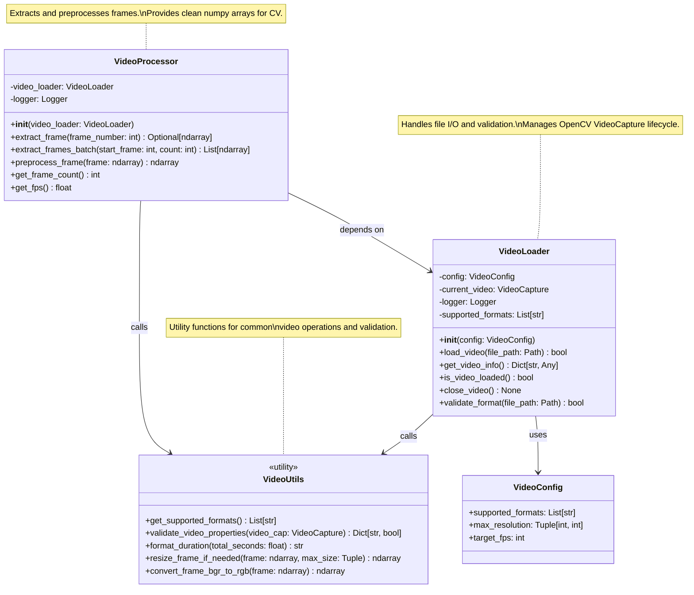
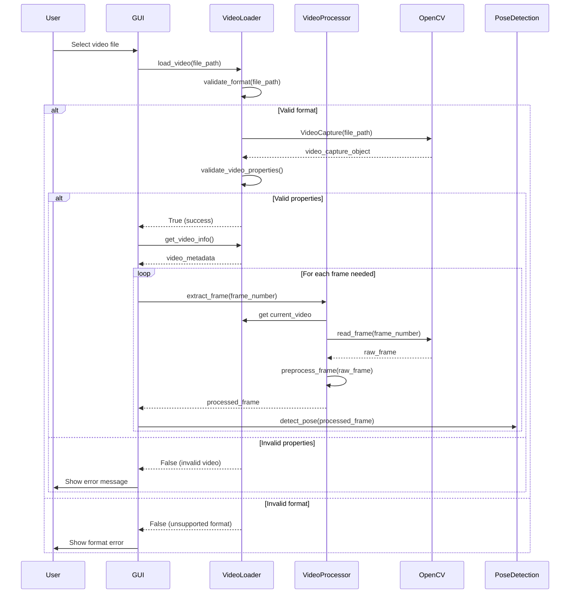
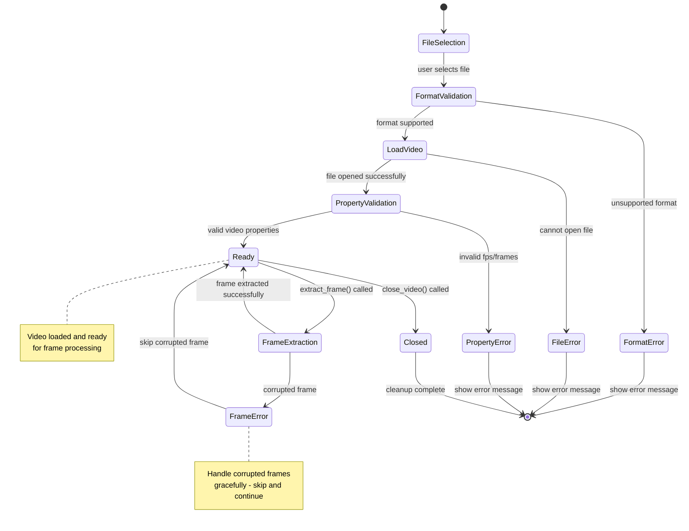
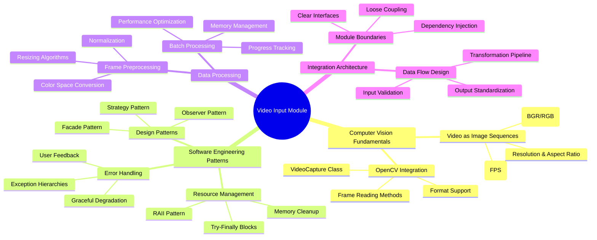

# Component 1: Video Input Module - Visual Architecture

## 🏗️ Component Class Diagram



## 🔄 Data Flow Sequence Diagram



## 🔗 Component Integration Diagram

```mermaid
graph TD
    A[🖥️ GUI Module] -->|file_path| B[📁 VideoLoader]
    B -->|video_metadata| A
    B -->|VideoCapture| C[🎞️ VideoProcessor]
    C -->|numpy.ndarray frames| D[🤖 Pose Detection]
    C -->|display frames| A
    
    E[⚙️ VideoConfig] --> B
    F[🛠️ VideoUtils] --> B
    F --> C
    
    B -->|BGR frames| G[📊 OpenCV VideoCapture]
    D -->|pose_landmarks| A
    
    classDef gui fill:#e1f5fe
    classDef video fill:#f3e5f5
    classDef cv fill:#e8f5e8
    classDef config fill:#fff3e0
    
    class A gui
    class B,C video
    class D,G cv
    class E,F config
```



## ⚠️ Error Handling State Diagram



## 🏛️ Module Architecture Overview

```mermaid
graph LR
    subgraph "Video Input Module"
        A[video_loader.py<br/>📁 VideoLoader Class]
        B[video_processor.py<br/>🎞️ VideoProcessor Class] 
        C[video_utils.py<br/>🛠️ Utility Functions]
        D[__init__.py<br/>📋 Module Exports]
    end
    
    subgraph "External Dependencies"
        E[OpenCV<br/>cv2.VideoCapture]
        F[NumPy<br/>ndarray operations]
        G[Pathlib<br/>file path handling]
    end
    
    subgraph "Project Integration"
        H[Config Module<br/>⚙️ Settings]
        I[GUI Module<br/>🖥️ Interface]
        J[Pose Detection<br/>🤖 Analysis]
    end
    
    A --> E
    A --> G
    B --> A
    B --> F
    C --> E
    C --> F
    D --> A
    D --> B
    D --> C
    
    H --> A
    I --> A
    I --> B
    B --> J
    
    classDef module fill:#bbdefb
    classDef external fill:#c8e6c9
    classDef integration fill:#ffcdd2
    
    class A,B,C,D module
    class E,F,G external
    class H,I,J integration
```



## 📊 Method Call Flow

```mermaid
flowchart TD
    Start([User Loads Video]) --> A{File Exists?}
    
    A -->|No| Error1[FileNotFoundError]
    A -->|Yes| B[validate_format()]
    
    B --> C{Supported Format?}
    C -->|No| Error2[UnsupportedFormatError]
    C -->|Yes| D[cv2.VideoCapture()]
    
    D --> E{Video Opens?}
    E -->|No| Error3[VideoLoadError]
    E -->|Yes| F[validate_video_properties()]
    
    F --> G{Valid Properties?}
    G -->|No| Error4[InvalidVideoError]
    G -->|Yes| H[Store VideoCapture]
    
    H --> I[Return Success]
    I --> J[Ready for Frame Extraction]
    
    J --> K[extract_frame(n)]
    K --> L[set_frame_position(n)]
    L --> M[read_frame()]
    M --> N{Frame Read OK?}
    
    N -->|No| O[Skip/Log Warning]
    N -->|Yes| P[preprocess_frame()]
    P --> Q[resize_if_needed()]
    Q --> R[Return numpy.ndarray]
    
    O --> J
    R --> S[Frame Ready for Pose Detection]
    
    Error1 --> End([Log Error & Exit])
    Error2 --> End
    Error3 --> End
    Error4 --> End
    
    classDef success fill:#c8e6c9
    classDef error fill:#ffcdd2
    classDef process fill:#e1f5fe
    classDef decision fill:#fff3e0
    
    class I,H,R,S success
    class Error1,Error2,Error3,Error4,End error
    class B,D,F,K,L,M,P,Q process
    class A,C,E,G,N decision
```

## 🎓 Educational Concepts Map



## 📋 Component Responsibilities Matrix

| Component | Primary Responsibility | Key Methods | Integration Points |
|-----------|----------------------|-------------|-------------------|
| **VideoLoader** | File I/O & Validation | `load_video()`, `validate_format()` | → GUI (file dialogs)<br/>→ Config (settings) |
| **VideoProcessor** | Frame Operations | `extract_frame()`, `preprocess_frame()` | → VideoLoader (source)<br/>→ Pose Detection (output) |
| **VideoUtils** | Common Operations | `resize_frame_if_needed()`, `validate_properties()` | ← VideoLoader<br/>← VideoProcessor |
| **Module Interface** | API Boundary | `__init__.py` exports | → All external modules |

## 🔧 Technical Implementation Notes

### Key Design Decisions:
1. **Composition over Inheritance**: VideoProcessor depends on VideoLoader rather than extending it
2. **Error Isolation**: Each component handles its own errors without propagating failures
3. **Resource Management**: Explicit cleanup methods for OpenCV VideoCapture objects
4. **Stateless Utilities**: VideoUtils functions are pure functions for maximum reusability
5. **Configuration Injection**: Dependencies passed via constructor for testability

### Performance Considerations:
- Frame extraction optimized for sequential access patterns
- Memory usage minimized through immediate frame processing
- Batch operations available for bulk frame extraction
- Preprocessing only applied when necessary (size/format checks)

### Educational Value:
- Clear separation of concerns demonstrates modular design
- Error handling patterns show robust software development
- OpenCV integration teaches computer vision fundamentals
- Resource management illustrates systems programming concepts