# Component 2 Visual Architecture Diagrams - MediaPipe Pose Detection

## 🎨 **UML/MERMAID ARCHITECTURE VISUALIZATIONS**

**Component:** MediaPipe Pose Detection Engine  
**Purpose:** Visual understanding of pose detection architecture, data flow, and integration patterns  
**Format:** Professional UML/Mermaid diagrams for educational clarity  

---

## 🏗️ **COMPONENT ARCHITECTURE OVERVIEW**

### **System Integration Diagram**


### **Data Flow Architecture**

```mermaid
sequenceDiagram
    participant VL as VideoLoader
    participant MD as MediaPipeDetector
    participant LE as LandmarkExtractor
    participant PR as PoseDetectionResult
    
    VL->>MD: get_next_frame()
    Note over VL,MD: np.ndarray (BGR format)
    
    MD->>MD: convert BGR→RGB
    MD->>MD: MediaPipe.process()
    
    MD->>LE: extract_pose_landmarks()
    Note over MD,LE: Raw MediaPipe results
    
    LE->>LE: filter_by_confidence()
    LE->>LE: extract_guitar_landmarks()
    LE->>LE: normalize_coordinates()
    
    LE->>PR: create_result_structure()
    Note over LE,PR: Structured guitar landmarks
    
    PR-->>MD: PoseDetectionResult
    MD-->>VL: detection complete
```


---

## 🔬 **MICRO-INCREMENTAL DEVELOPMENT FLOW**

### **Development Sequence Diagram**


### **Validation Gates Flow**


---

## 🧠 **MEDIAPIPE INTEGRATION ARCHITECTURE**

### **MediaPipe Processing Pipeline**


### **Landmark Mapping Visualization**


---

## 🏛️ **CLASS ARCHITECTURE DESIGN**

### **Component Class Relationships**


### **Configuration Integration Pattern**
```mermaid
graph LR
    A[config/10_project_config.yaml] --> B[ConfigManager]
    B --> C[get_project_config()]
    C --> D[pose_detection section]
    D --> E[MediaPipeDetector]
    
    subgraph "Config Hierarchy"
        F[pose_detection.core]
        G[pose_detection.guitar_analysis]
        H[pose_detection.performance]
        I[pose_detection.output]
    end
    
    D --> F
    D --> G
    D --> H
    D --> I
    
    style A fill:#e3f2fd
    style E fill:#fff3e0
```

---

## 🧪 **TESTING ARCHITECTURE**

### **Test Integration Flow**


### **Validation Strategy Diagram**


---

## 🔗 **INTEGRATION PREPARATION**

### **Component 3 Interface Design**


### **Future Pipeline Extension**


---

## 📊 **PERFORMANCE CONSIDERATIONS**

### **Processing Timeline**


### **Memory Usage Pattern**


**These diagrams provide complete visual understanding of Component 2 architecture, enabling clear implementation and integration with existing infrastructure.**